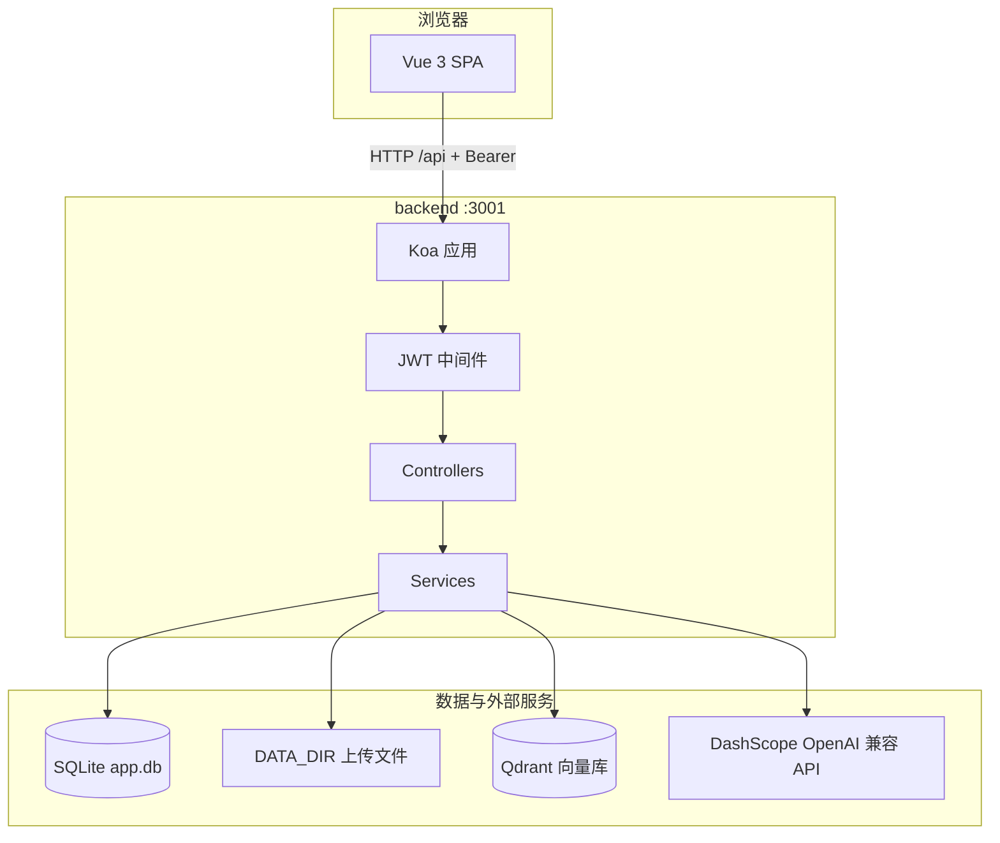
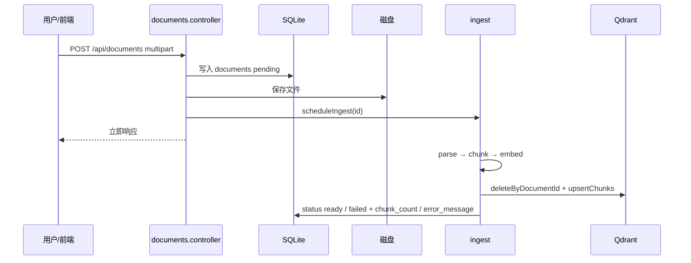
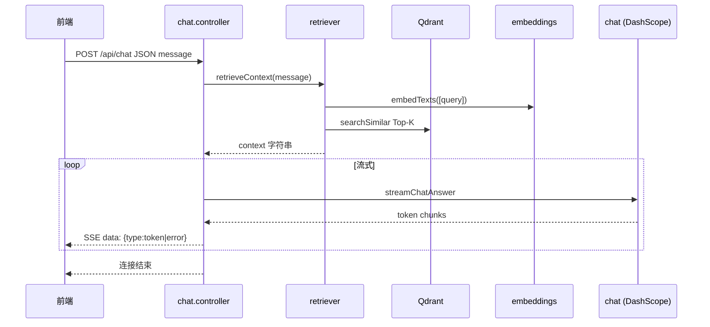

# 公司内部文档 RAG 系统 — 项目架构说明

本文描述 **company-docs-rag**  monorepo 的整体结构、运行时组件、数据流与扩展边界，便于 onboarding、评审与运维排障。产品定位与运行方式仍以仓库根目录 [README.md](../README.md) 为准。

---

## 1. 架构目标与边界

| 维度 | 说明 |
|------|------|
| 业务目标 | 基于 PDF/Word 制度文档的 RAG 问答：上传制度文件，员工用自然语言提问，模型在「检索到的片段」约束下生成回答。 |
| 技术边界 | 单租户后台式管理：JWT 鉴权、管理员账号种子；无多租户隔离设计。 |
| 非目标 | 本文不展开通义千问计费、Qdrant 集群高可用等云厂商侧细节。 |

---

## 2. 仓库与工程结构

采用 **pnpm workspace** 管理多包，根目录脚本并行启动前后端。

```
rag/
├── package.json              # workspace 根：dev / build / lint
├── pnpm-workspace.yaml         # packages: backend, frontend
├── .env / .env.example         # 环境变量（后端可读仓库根或 backend 下 .env）
├── docker-compose.yml          # 仅定义 Qdrant 服务
├── backend/                    # Koa + TypeScript API
│   ├── src/
│   │   ├── server.ts           # HTTP 入口
│   │   ├── app.ts              # Koa 实例与中间件链
│   │   ├── config/env.ts       # Zod 校验的环境配置
│   │   ├── routes/             # /api 路由与 multer 上传
│   │   ├── controllers/        # 请求处理（薄层）
│   │   ├── services/           # 业务：解析、切块、向量、检索、对话、入库
│   │   ├── middleware/         # 错误处理、JWT
│   │   ├── store/db.ts         # SQLite 单例与迁移
│   │   └── utils/              # 日志、HTTP 错误等
│   └── package.json
└── frontend/                   # Vue 3 + Vite + Element Plus
    ├── src/
    │   ├── main.ts / App.vue
    │   ├── router.ts           # 路由与登录守卫
    │   ├── api/client.ts       # Axios 实例 + JWT 拦截器
    │   ├── stores/             # Pinia：auth、assistantChat 等
    │   ├── views/              # Login、Layout、Dashboard、Documents、Chat
    │   └── components/
    └── vite.config.ts          # 开发期 /api 代理到后端
```

---

## 3. 逻辑架构（组件视图）



---

## 4. 运行时拓扑

| 组件 | 职责 | 默认/典型配置 |
|------|------|----------------|
| **frontend** | 静态 SPA + 开发代理 | Vite `5173`，`/api` → 后端 |
| **backend** | REST + SSE | `HOST`/`PORT`（见 `env.ts`） |
| **SQLite** | 用户、文档元数据与索引状态 | `DATA_DIR/app.db`，WAL 模式 |
| **Qdrant** | 文档块向量与 payload | `docker-compose` 暴露 `6333` |
| **DashScope** | `text-embedding-v3` 与 `qwen-plus`（可配置） | `DASHSCOPE_*`、`CHAT_MODEL`、`EMBEDDING_MODEL` |

向量集合维度须与 `EMBEDDING_DIMENSIONS` 及 Qdrant collection 一致，由 `vectorStore` 在写入前 `ensureCollection`。

---

## 5. 后端分层约定

1. **`app.ts`**：中间件顺序固定 — 错误处理 → CORS → `koa-bodyparser` → 路由。
2. **`routes/index.ts`**：统一前缀 `/api`；公开路由为 `GET /health`、`POST /auth/login`；其余挂 `jwtAuth`。
3. **Controllers**：解析请求体、设置状态码；流式接口（如聊天）通过 `ctx.respond = false` 直接写 `ServerResponse`。
4. **Services**：无 HTTP 感知 — 解析（`parser`）、切块（`chunker`）、向量化（`embeddings`）、Qdrant（`vectorStore`）、索引编排（`ingest`）、检索（`retriever`）、流式对话（`chat`）、文档 CRUD（`documents.service`）、认证（`auth.service`）。
5. **`store/db.ts`**：better-sqlite3 单例；启动时执行幂等 `migrate`。

---

## 6. 核心数据流

### 6.1 文档上传与索引（异步）



要点：`scheduleIngest` 在微任务中执行，避免阻塞上传响应；内存 `Set` 防止同一 `documentId` 并发重入。

### 6.2 智能问答（SSE）



检索结果拼入系统提示词，约束模型仅依据「参考资料」作答；无命中时由提示词引导拒答话术。

---

## 7. 前端结构

| 模块 | 说明 |
|------|------|
| **router.ts** | `/login` 为公开路由；`/` 下 Layout 子路由：仪表盘、文档管理、智能问答；`beforeEach` 检查 Pinia `auth.isAuthenticated`。 |
| **api/client.ts** | `baseURL: /api`，请求头附加 `Authorization: Bearer`；401 时清空 token 并跳转登录。 |
| **views** | `Documents.vue` 上传与列表状态；`Chat.vue` / 相关组件消费 SSE，与后端事件格式 `{ type: 'token' \| 'error' }` 对齐。 |

---

## 8. 数据模型摘要

### 8.1 SQLite（业务元数据）

- **users**：`id`, `username`, `password_hash`, `created_at`
- **documents**：`id`, `original_name`, `stored_name`, `mime`, `size`, `file_path`, `status`（`pending` | `indexing` | `ready` | `failed`）, `chunk_count`, `error_message`, 时间戳；`status` 上有索引便于列表筛选。

### 8.2 Qdrant（检索载荷）

每个向量点包含 payload（示意）：`documentId`, `filename`, `chunkIndex`, `text`。检索侧 `TOP_K` 等常量定义在 `retriever.ts`，可按上下文窗口调优。

---

## 9. 安全与认证

- **认证**：登录成功后签发 JWT；受保护路由使用 `jwtAuth` 校验 `Authorization: Bearer`。
- **密码**：用户表存哈希；种子管理员来自环境变量（见 `env.ts` 中 `ADMIN_*`）。
- **CORS**：开发期 `origin: "*"`；生产建议改为前端域名白名单并按需调整 `credentials`。
- **上传**：multer 内存存储 + 大小上限与 bodyparser 限制对齐；文件类型由解析层按 `mime` 分支处理。

---

## 10. 配置说明

所有进程级配置经 **`backend/src/config/env.ts`** 中 Zod schema 校验后通过 `getEnv()` 读取，避免散落魔法字符串。必填项缺失会在启动阶段抛错，便于 CI/部署早发现。

主要类别：HTTP 监听、DashScope 密钥与 Base URL、模型名与向量维度、Qdrant URL/集合名、JWT 与管理员种子、`DATA_DIR`。

---

## 11. 部署与运维注意点

1. **进程模型**：当前为单 Node 进程 + SQLite；水平扩展多实例前需重新评估 SQLite 写入与文件上传路径一致性。
2. **Qdrant**：持久化依赖 `docker-compose` 中 named volume；升级镜像时注意兼容性。
3. **前端产物**：`pnpm --filter frontend build` 后静态资源可由 Nginx 托管；`/api` 需反向代理到 Node 或同域网关。
4. **流式响应**：已设置 `X-Accel-Buffering: no` 以利于 Nginx 下 SSE；代理层需禁用对 SSE 路径的缓冲与超时过短问题。

---

## 12. 相关文档

- [README.md](../README.md)：快速开始、API 表、验收步骤  
- [examples/README.md](../examples/README.md)：示例提问（若存在）

---

*文档版本与代码仓库同步维护；若目录或接口变更，请同步更新本节与 README 中的 API 表。*
